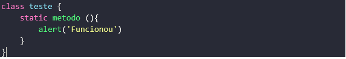
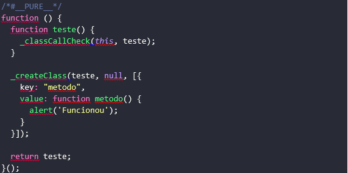
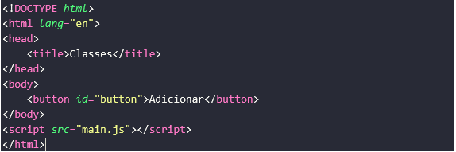
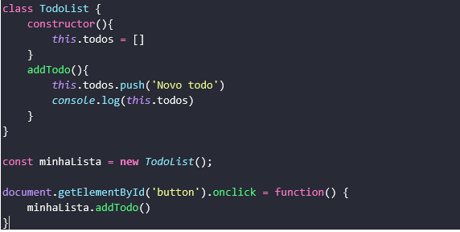
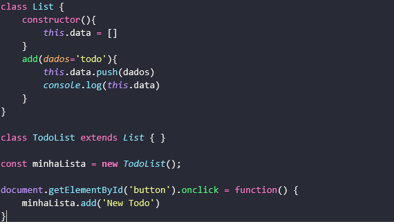
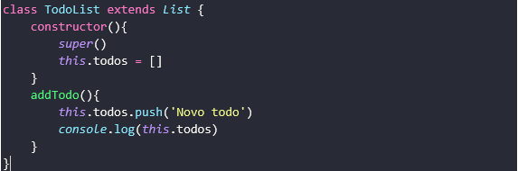
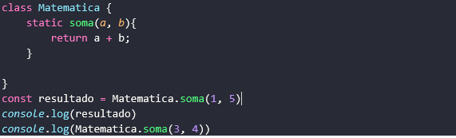

# CURSO JAVASCRIPT ES6+

### INTRODUÇÃO
<h5>O ECMAScript 2015 é um padrão ECMAScript que foi ratificado em junho de 2015.</h5>

ES2015 é uma atualização significativa para o JavaScript, e a primeira grande atualização desde que o ES5 foi padronizado em 2009. A implementação desses recursos nos principais mecanismos JavaScript está em andamento agora.

Consulte o <a href="http://www.ecma-international.org/ecma-262/6.0/index.html" target="blank">padrão ES2015 </a> para obter a especificação completa do ECMAScript 2015.

Este repositório trata-se de um curso de JavaScript ES6+ que aborda as principais feature do javaScript 2015 e as mais atuais.   No decorrer do curso iremos aprender não somente as novas features JS, mas trabalhares com babel, webpack e yarn em uma aplicação simples utilizando todos os recursos aprendidos no curso, é extremamente recomendado que ao iniciar o curso você já possua um conhecimento básico de lógica de programação e esteja familiarizado com terminal de controle de seu sistema operacional.

<h4>Recursos do JavaScript ES6+ e Tópicos Extras.</h4>
<ul>
    <li><a href="https://github.com/lucaspedronet/curso-ecmas6-news-features#-ecmascript-2015-" target="blank">ECMAScript 2015</a></li>
    <li><a href="https://github.com/lucaspedronet/curso-ecmas6-news-features#-instala%C3%A7%C3%A3o-e-configura%C3%A7%C3%A3o-" target="blank">Instalação e Configuração</a></li>
    <li><a href="https://github.com/lucaspedronet/curso-ecmas6-news-features#-babel-" target="blank">Babel</a></li>
    <li><a href="https://github.com/lucaspedronet/curso-ecmas6-news-features#-classe-" target="blank">Classe</a></li>
    <li><a href="https://github.com/lucaspedronet/curso-ecmas6-news-features#-const--let-" target="blank">Const & Let</a></li>
    <li><a href="https://github.com/lucaspedronet/curso-ecmas6-news-features#-array-" target="blank">Array</a></li>
    <li><a href="https://github.com/lucaspedronet/curso-ecmas6-news-features#-arrow-" target="blank">Arrow</a></li>
    <li><a href="https://github.com/lucaspedronet/curso-ecmas6-news-features#-valores-padr%C3%B5es-" target="blank">Valores padrões</a></li>
    <li><a href="https://github.com/lucaspedronet/curso-ecmas6-news-features#-desistrutura%C3%A7%C3%A3o-" target="blank">Desistruturação</a></li>
    <li><a href="https://github.com/lucaspedronet/curso-ecmas6-news-features#-rest--spread-" target="blank">Rest & Spread</a></li>
    <li><a href="https://github.com/lucaspedronet/curso-ecmas6-news-features#-templete-literal-" target="blank">Templete Literal</a></li>
    <li><a href="https://github.com/lucaspedronet/curso-ecmas6-news-features#-sintaxe-curta-objetos-" target="blank">Sintaxe curta objetos</a></li>
    <li><a href="https://github.com/lucaspedronet/curso-ecmas6-news-features#-webpack-" target="blank">Webpack</a></li>
    <li><a href="https://github.com/lucaspedronet/curso-ecmas6-news-features#-import--export-" target="blank">Import & Export</a></li>
    <li><a href="https://github.com/lucaspedronet/curso-ecmas6-news-features#-webpack-devserver-" target="blank">Webpack devServer</a></li>
    <li><a href="https://github.com/lucaspedronet/curso-ecmas6-news-features#-async--await-" target="blank">Async & Await</a></li>
    <li><a href="https://github.com/lucaspedronet/curso-ecmas6-news-features#-axios-e-api-" target="blank">Axios e Api</a></li>
    <li><a href="https://github.com/lucaspedronet/curso-ecmas6-news-features#-app-com-es6-" target="blank">App com es6+</a></li>
    <li><a href="https://github.com/lucaspedronet/curso-ecmas6-news-features#-adicionando-repos-" target="blank">Adicionando repos</a></li>
    <li><a href="https://github.com/lucaspedronet/curso-ecmas6-news-features#-buscando-api-" target="blank">Buscando Api</a></li>
    <li><a href="https://github.com/lucaspedronet/curso-ecmas6-news-features#-loading-" target="blank">Loading</a></li>
</ul>

 
<h2> ECMAScript 2015 </h2>

Fala galera tudo bem com vocês? Meu nome é Lucas Pedro estou cursando o 5ª período em Engenharia de Software e irei ministrar esse curso de javscript ES6+. Antes que possamos dar início às explicações e colocar a mão na	massa, é muito importante entender corretamente o que é o ECMAScript e qual a sua relação com o JavaScript. O ECMAScript (ES) é a especificação da linguagem de script que o JavaScript implementa. Isto é, a descrição de uma linguagem de script, sendo padronizado	pela Ecma International (http://www.ecmascript.org/index.php) —	associação criada em 1961 dedicada à padronização de	sistemas de	informação e comunicação — na especificação	ECMA-262. ECMAScript 2015 sofreu uma mudança significativa melhorando o desenvolvimento e trabalhando melhor os conceitos como paradigmo Orientado Objeto já concebido em outras liguagem como Java e PHP, vários outros recurso que ajudam a tornar o JS uma liguagem ainda mais poderesa.
Então sem mais delongas vamos dar início ao curso. 
  

<h2> Instalação e Configuração </h2>

Para darmos inicio no curso teremos que baixar um gerenciado de dependências que facilitará a instalação de pacotes e bibliotecas, nesse caso será o chocolatey para Windows pois será o sistema que iremos trabalhar daqui pra frente, então acese o site do <a href="https://chocolatey.org/" target="blank">chocolatey</a> e siga as instruções de instalção:   
<b>Instalar com o PowerShell</b> 

Precione as teclas em conjuto (windows + X) e escolha Windows PoweShell(admin) irá abrir uma janela, execute o seguinte comando: <b>Get-ExecutionPolicy.</b> Se ele retornar `Restricted`, execute `Set-ExecutionPolicy AllSigned` ou `Set-ExecutionPolicy Bypass -Scope Process`.

Agora, execute o seguinte comando: (copiar texto de comando)

<pre><code> Set-ExecutionPolicy Bypass -Scope Process -Force; iex ((New-Object System.Net.WebClient).DownloadString('https://chocolatey.org/install.ps1'))</code></pre> 

Precione enter e aguarde a instalação concluir, feito isso abra outro terminal e figite o comando `choco --version` para verificar o funcionamento do <b>chocolatey.</b> Agora vamos instalar o <b>Yarn</b> então mais uma vez em seu terminal digite `choco install yarn` esse comando também irá instalar o <a href="https://nodejs.org" target="blank">Node.js</a> caso não esteja instalado, caso queira instalar individualmente basta acessar o site (<a href="https://nodejs.org/en/" target="blank">https://nodejs.org/en/</a>). Agora teste o yarn e node digitando os camonado `yarn --version` e `node --version` ambos devem aparecer suas repectivas versões.  

  

<h2> Babel </h2>

Configurando o Babel, depois de ter instalado o node e yarn em sua máquina vamos criar uma paste de nome <i>es6</i> que irá conter nosso projeto, em seguida abra seu terminal a partir dessa pasta e execute o seguinte comando: `yarn init` Pressione a tecla Entre até aparecer a mensagem <i>success saved packege.json</i> (As versoes mais recente do yarn pode pedir para que informe o nome do projeto nesse caso pode colocar o mesmo nome da pasta do projeto) esse comando criará um arquivo packege,json que gerenciará as dependências instaladas no projeto. Vamos precisar instalar algumas dependências e para isso precisamos da linha de comando do Babel instalada.

 
<Ul>
    <li><code>$ yarn add @babel/cli</code> [ Instalando a cli do babel (linha de comando do Babel). ]</li>
    <li><code>$ @babel/preset-env</code> [ Instalando a preset-env. ]</li>
</ul>

Vamos criar na raiz de nosso projeto um arquivo `.babelrc`  que vai conter o seguinte trecho de código:

<code>
{ 
    "presets": ["@babel/preset-env"] 
} 

</code>

O babel possui vários preset-env ele vai identificar qual ambiente nós estamos utilizando para desenvolver se é um navegador (páginas web), Servidor nodejs (API Rest) ou Mobile(RN) e fará o trabalho de transpilar todo nosso código JSES6+ para um versão que seja compreendia pela maioria do navegadores e irá fazer isso da melhor forma possível. 
Vamos adicionar mais uma dependência ao babel: 

<code>yarn add @babel/core</code>
  

Agora ainda na raiz de nosso projeto vamos criar um arquivo index.html e main.js dentro do main.js adicione um <code>alert(‘Funcionou’)</code>. 
Feito isso vamos no arquivo packege.json e criar mais um objeto de nome “script” conforme figura abaixo:  
<code>
"scripts": { 
    "dev": "babel ./main.js -o ./bundle.js" 
  }
  </code>

 

O atributo <i>dev</i> vai pegar nosso arquivo <i>main.js</i> e transpilar todo o seu código em um novo arquivo chamado bunlde.js que seja compreendido por maioria dos navegadores, para realizar essa transpilação vá em seu terminal e digite <b>yarn dev.</b>  
Note que foi criado um arquivo budle.js na raiz de seu projeto contendo o código convertido, mas perceba que nada mudou se comparado com main.js isso ocorre porque o <code>alert(‘Funcionou’)</code> é uma função reconhecida por versões anterios do ECS então ela é compreendida por todos os navegadores por isso não requer uma transpilação.

<h2> Classe </h2>

Então vamos adicionar uma classe que é um das features da versão mais recente no ECS6+ acompanhe na imagem abaixo, dentro do main.js reescreva o código da seguinte forma:

 
 

Agora abra seu arquivo budle.js e veja como ficou! 

 

Agora vamos adicionar um parâmetro que vai nos permitir a conversão dos código do budle de maneira automática, assim toda vez em que realizarmos alguma alteração no arquivo <em><strong>main.js</strong></em> e salvar ele irá transpilar automaticamente sempre que for realizado.  
Vamos inserir um código simples em nosso arquivo de html o index.

 

 

Já no arquivo main.js vamos adicionar um código utilizando classes como recurso da ECSE6+

 

O <code>constructor() { }</code> é o primeiro método de uma classe e ele é o responsável por iniciar os objetos dessa classe assim como seus atributos. 
As classes possuem métodos <i>static</i> veremos mais na frete sobre. Na linha 12 temos uma constante <em><strong>minhaLista</strong></em> que recebe uma instância da classe <code>TodoList()</code>, a partir dessa nova instância podemos invocar seus métodos e atributos de classe.  

<h4>Herança </h4>

Outra característica interessante das classes é que podemos herdar métodos e atributos da classe pai (também é conhecida por classe mãe) da mesma forma que temos em linguagem mais madura no paradigma da Orientação a Objeto.  
Veja como poderíamos utilizar a herança de classes em nosso exemplo da classe </i>TodoList()</i>. 

 

Perceba que criamos uma classe de nome <em><strong>List</strong></em> que contém um atributo data e um método <em><strong>add()</strong></em>, já na <code>classe TodoList</code> nós utilizamos o recurso do <em><strong>extends</strong></em> para herdarmos os atributos e métodos da <code>classe List</code>, desta forma temos acesso a todos os seus recurso. Também conseguimos adicionar mais funcionalidades (atributos e métodos) a essa classe herdada, se esse for o caso precisaremos utilizar o recurso do <code>super()</code> dentro do construtor da classe filho e em seguida adicionar os novos atributos e métodos à <em><strong>classe TodoList</strong></em>, vejamos o exemplo abaixo.

 

Os métodos static possui uma particularidade, com ele conseguimos invocar um método sem a necessidade de instanciar um objeto <code>cons minhaLista = new TodoList()</code>  e em seguida <code>minhaLista.add()</code> isso ocorre porque os métodos statcs não enxergam o escopo externo ou seja ele só manipula informações interna no método ignorando o <code>constructor()</code> e restante da classe, ele é muito utilizado para receber alguma informação e gerar outra independente do contexto externo na classe em que foi criado, veja um exemplo com <em><strong>classe Matematica</strong></em> e método <em><strong>static soma()</strong></em>:

 

<h2> Const & Let </h2>

Se você utiliza o javaScript básico há algum tempo sabe que utilizamos a palavra reservada var nomeDaVariavel = “valor” para declarar/iniciar variáveis e com as novas feature de ECS6+ ganhamos mais duas novas maneiras de declaramos uma é a const e a outra é let. 
Uma constante não pode ter seu valor reatribuido, neste caso podemos multar seu valor e qual seria a diferencia entre multar e reatribuir valor de uma constante. Quando utilizamos a sintaxe de objetos conseguimos reatribuir os valores dos seus atributos vejamos: 
<code>
const a = 1 
a = 3  
const objeto = {  
    nome: "Lucas", 
    idade: 25 
} 
objeto.idade = 25  
console.log(objeto, a) 
</code>

<h2> Array </h2>
<h2> Arrow </h2>
<h2> Valores padrões </h2>
<h2> Desistruturação </h2>
<h2> Rest & Spread </h2>
<h2> Templete Literal </h2>
<h2> Sintaxe curta objetos </h2>
<h2> Webpack </h2>
<h2> Import & Export </h2>
<h2> Webpack devServer </h2>
<h2> Async & Await </h2>
<h2> Axios e Api </h2>
<h2> App com es6+ </h2>
<h2> Adicionando repos </h2>
<h2> Buscando Api </h2>
<h2> Loading </h2>
