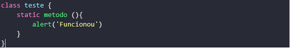
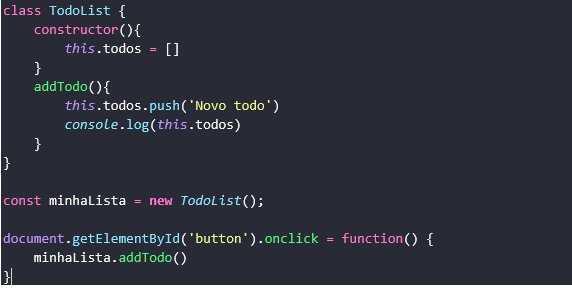
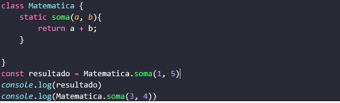

<h1> Classe </h1>

Então vamos adicionar uma classe que é um das features da versão mais recente no ECS6+ acompanhe na imagem abaixo, dentro do main.js reescreva o código da seguinte forma:

 
 

Agora abra seu arquivo budle.js e veja como ficou! 

 

Agora vamos adicionar um parâmetro que vai nos permitir a conversão dos código do budle de maneira automática, assim toda vez em que realizarmos alguma alteração no arquivo <em><strong>main.js</strong></em> e salvar ele irá transpilar automaticamente sempre que for realizado.  
Vamos inserir um código simples em nosso arquivo de html o index.

 

 

Já no arquivo main.js vamos adicionar um código utilizando classes como recurso da ECSE6+

 

O <code>constructor() { }</code> é o primeiro método de uma classe e ele é o responsável por iniciar os objetos dessa classe assim como seus atributos. 
As classes possuem métodos <i>static</i> veremos mais na frete sobre. Na linha 12 temos uma constante <em><strong>minhaLista</strong></em> que recebe uma instância da classe <code>TodoList()</code>, a partir dessa nova instância podemos invocar seus métodos e atributos de classe.  

<h4>Herança </h4>

Outra característica interessante das classes é que podemos herdar métodos e atributos da classe pai (também é conhecida por classe mãe) da mesma forma que temos em linguagem mais madura no paradigma da Orientação a Objeto.  
Veja como poderíamos utilizar a herança de classes em nosso exemplo da classe </i>TodoList()</i>. 

 

Perceba que criamos uma classe de nome <em><strong>List</strong></em> que contém um atributo data e um método <em><strong>add()</strong></em>, já na <code>classe TodoList</code> nós utilizamos o recurso do <em><strong>extends</strong></em> para herdarmos os atributos e métodos da <code>classe List</code>, desta forma temos acesso a todos os seus recurso. Também conseguimos adicionar mais funcionalidades (atributos e métodos) a essa classe herdada, se esse for o caso precisaremos utilizar o recurso do <code>super()</code> dentro do construtor da classe filho e em seguida adicionar os novos atributos e métodos à <em><strong>classe TodoList</strong></em>, vejamos o exemplo abaixo.

 

Os métodos static possui uma particularidade, com ele conseguimos invocar um método sem a necessidade de instanciar um objeto <code>cons minhaLista = new TodoList()</code>  e em seguida <code>minhaLista.add()</code> isso ocorre porque os métodos statcs não enxergam o escopo externo ou seja ele só manipula informações interna no método ignorando o <code>constructor()</code> e restante da classe, ele é muito utilizado para receber alguma informação e gerar outra independente do contexto externo na classe em que foi criado, veja um exemplo com <em><strong>classe Matematica</strong></em> e método <em><strong>static soma()</strong></em>:

 