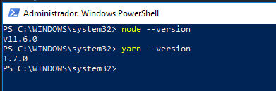

<h1> Instalação e Configuração </h1>

Para darmos inicio no curso teremos que baixar um gerenciado de dependências que facilitará a instalação de pacotes e bibliotecas, nesse caso será o chocolatey para Windows pois será o sistema que iremos trabalhar daqui pra frente, então acese o site do <a href="https://chocolatey.org/" target="blank">chocolatey</a> e siga as instruções de instalção:   
<b>Instalar com o PowerShell</b> 

Precione as teclas em conjuto (windows + X) e escolha Windows PoweShell(admin) irá abrir uma janela, execute o seguinte comando: <b>Get-ExecutionPolicy.</b> Se ele retornar `Restricted`, execute `Set-ExecutionPolicy AllSigned` ou `Set-ExecutionPolicy Bypass -Scope Process`.

Agora, execute o seguinte comando: (copiar texto de comando)

<pre><code> Set-ExecutionPolicy Bypass -Scope Process -Force; iex ((New-Object System.Net.WebClient).DownloadString('https://chocolatey.org/install.ps1'))</code></pre> 

Precione enter e aguarde a instalação concluir, feito isso abra outro terminal e figite o comando `choco --version` para verificar o funcionamento do <b>chocolatey.</b> Agora vamos instalar o <b>Yarn</b> então mais uma vez em seu terminal digite `choco install yarn` esse comando também irá instalar o <a href="https://nodejs.org" target="blank">Node.js</a> caso não esteja instalado, caso queira instalar individualmente basta acessar o site (<a href="https://nodejs.org/en/" target="blank">https://nodejs.org/en/</a>). Agora teste o yarn e node digitando os camonado `yarn --version` e `node --version` ambos devem aparecer suas repectivas versões.  

