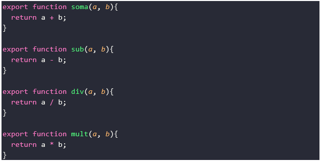
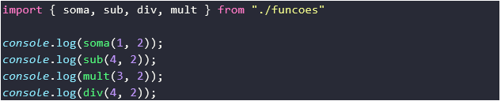
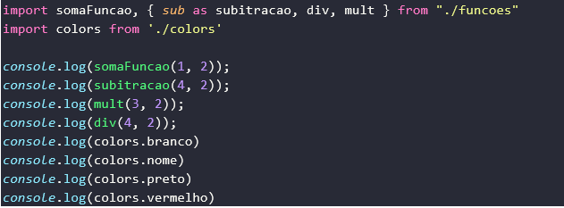

<h1> Trabalhando com import & Expport </h1>

  
Em sequência vamos colocar o nosso webpack pra rodar, vá em seu terminal e digite <b>yarn dev</b>. Para testarmos esse webpack vamos começar a trabalhar com <em>import/export </em>e antes de mais nada alteraremos o arquivo <em>index.js</em> que atualmente recebe em seu script o <em>main.js</em> e vamos alterar para <em>bundle.js</em>.
  
 

  
Vamos então criar um novo arquivo de nome funções.js que conterá as seguintes funções: 

  

  

    
Então dentro do arquivo <i>main.js</i> vamos importa as funções que acabamos de criar em nosso arquivo <i>funcoes.js</i>

  
    
  
    
Chamamos as funções entre chaves do arquivo <i><em>./funções</em></i> isso é bastante utilizado em bibliotecas como react e reac-native por exemplo, também conseguimos atribuir um default para alguma função, classe e etc porém apenas uma pode ser definida por arquivo. Bastando colocar a palavra default após o export ficando <b><em>export default function soma()</em></b>.
    

  

  <h4>Veja outros exemplos de import e export:</h4>

  

  
Quando definimos um export como <code>default</code> podemos importa-la sem a necessidade de usar as chaves entre ela e o mesmo pode ser renomeada para qualquer nome que desejar, foi o que aconteceu em somaFuncao, para obtermos os mesmos resultados sem utilizar default precisamos do <code>“as”</code> nesse caso deve ser passado entre chaves pois não estamos utilizando default, ficando da seguinte forma <code>import { sub as subtração } from “./funções”</code> .
  

