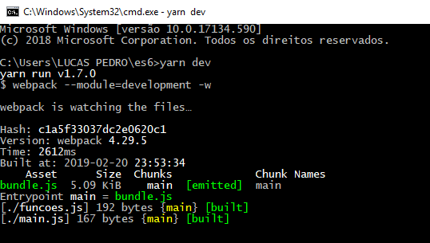

### Configurndo o Webpack

O que iremos fazer agora é <code>configurar o webpack</code>, este é uma espécie de serviço que irá nos disponibilizar uma forma de trabalhar com vários arquivos js na nossa aplicação, arquivos <i><em>js, css, json, html e etc</em></i> ou seja o webpack é um em pacotador de arquivos. Todos esses arquivos também serão transpilados para um único arquivo javascript <code>.bundle</code> com todas as informações. Abra o arquivo packege.json e faça a seguinte alteração no nome “dependencies” para <code>“devDepencies”:</code> 

<pre>
"devDependencies": {
    "@babel/cli": "^7.2.3",
    "@babel/core": "^7.2.2",
    "@babel/plugin-proposal-object-rest-spread": "^7.2.0",
    "@babel/preset-env": "^7.2.3",
  },
</pre>

Feita modificação necessária devemos colocar o sinal de “–D” antes de todas as dependências que queiramos instalar somente em ambiente de desenvolvimento, então vamos começar instalando o webpack e webpack-cli, vá em nosso terminal e digite os seguintes comandos: 

 <ul>
 <li><b>yarn add webpack webpack-cli -D</b>: <label>[Instalando webpack e webpack-cli]</label></li>
 <li><b>webpack-cli</b>: <label>[ <i><em>é a linha de comandos do webpack.</em></i>]</label></li>
 <li><b>webpack</b>: <label>[ <i><em>Em essência, o webpack é um empacotador de módulos estáticos para aplicativos JavaScript modernos. </em></i>]</label></li>
 </ul>

Agora vamos criar um arquivo de configuração do webpack esse arquivo vai ter o nome de <i><em>webpack.config.js</em></i> sendo este arquivo principal e ficará em nossa raiz e vai conter o seguinte código: 

<pre>module.exports = {
  mode: 'development'
  entry: './main.js',
  output: {
    path: __dirname,
    filename: 'bundle.js',
  },
  module: {
    rules: [
      {
        test: /\.js$/,
        exclude: /node_modules/,
        use: {
            loader: 'babel-loader',
        }
      }
    ]
  }
};</pre>

  <h4>Vamos conhecer um pouco mais sobre o código acima e suas propriedades.</h4>
  

    <b><em>Entry</em></b>: [<em> Nos diz qual arquivo é o principal em nosso projeto. </em>] 
    <b><em>Output</em></b>: [<code>{ }</code> <em>Recebe os caminho para onde dever ir o arquivo compilado (igual ao babel fazia antes) </em>] 
    <b><em>Path</em></b>: [<em> Recebe o endereço onde ficará o arquivo após conversão e <b><em>__dirname</em></b> é uma variável global que representa a raiz do projeto. </em>] 
    <b><em>Filename</em></b>: [ <em> Recebe o nome desse arquivo que contém código copilado. </em> ] 
    <b><em>Module</em></b>: [<code>{ }</code> <em>Module tem uma propriedade que vai nos dizer como deve se comporta um arquivos baseado em sua extensão</em> ] 
    <b><em>Test</em></b>: [ <em>Utilizamos aqui uma expressão regular que nos diz qual extensão de arquivo deve ser considerada. </em>] 
    <b><em>Exclude</em></b>: [<em> Dizemos qual pastas ou arquivos queremos excluir. </em>] 
    <b><em>Use</em></b>: { }:
  

  <h4>Voltamos ao terminal e vamos instalar mais uma dependência ao nosso package.json em ambiente de desenvolvimento.</h4>

  <b>yarn add babel-loader  –D</b> 

  
E em nosso arquivo package.json no scriprs devemos alterar deixando da seguinte forma:

  
  <pre>
"scripts": {
    "dev": "webpack --module-development -w"
  }
</pre>

  
Em seu terminal execute o comando <b>$ yarn dev</b> novamente, o resultado deve ser algo parecido com a imagem que temos abaixo.
 

  

  <h2> <a href="https://github.com/lucaspedronet/curso-ecmas6-news-features/blob/master/modulo-02-webpack-server/import-export.md" alt="Próximo conteúdo"> Trabalhando com import & Expport </a>

