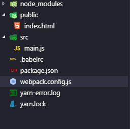
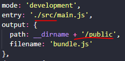
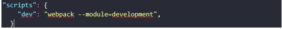
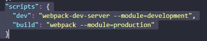
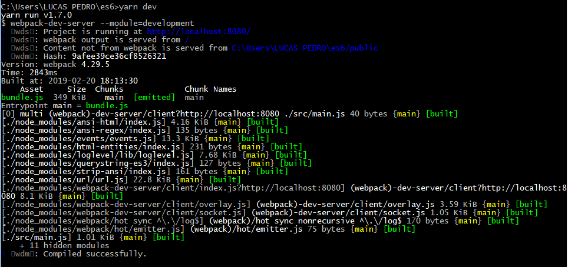

## Webpack DevServer 

  
Vamos começar fazendo algumas alterações em nossa estrutura, primeiro criaremos duas pastas uma nome <i><em>src</em></i> e outra com <i><em>public</em></i>, depois de criar as pastas vamos adicionar todos os arquivos <code>.js</code> que serão monitorados pelo webpack-dev-server e nesse caso será o <code>main.js</code> já em <i>public</i> ficarão os arquivos que não serão monitorados ou seja o <i>index.htmls</i> 
 

      

  
Com a nova estrutura de pasta que acabamos de definir, vamos alterar o nosso arquivo <code>webpack.config.js</code> para receber essas novas configurações, veja abaxo o que deve ser feito.
  

   
  
  <ul>
    <li><b><em>Entry<em></b>: [ <em><i>recebe um novo caminho já que o nosso arquivo <code>main.js</code> foi adicionado na pasta src.</i></em> ]</li>
    <li><b><em>Path</em></b>: [<em><i> recebe <code>+ ‘/public’</code> que é o novo caminho para index.html.</i></em> ]</li>
  </ul> 
  
  
Em seguida vamos instalar nosso <b><em>webpack-dev-server</em></b> no modo de desenvolvimento <i>“-D”</i> em seu terminal execute o seguinte comando:  
  <b><em> $ yarn add webpack-dev-server –D</em></b> 
  Após instalar webpack-dev-sever vamos voltar em nosso arquivo <code>webpack.config.js</code> realizar a seguintes alterações:
  
 

   

  
Veja que adicionamos uma nova configuração <code>devServe: {}</code> que possui uma propriedade contentBase cuja valor é igual a <code>__dirname + ‘/public’</code>, essa propriedade nos permite dizer onde o arquivo <b>build</b> (Buil são os arquivos que serão enviados para produção) de nossa aplicação será salva e especificamos esse caminho dizendo <code>__dirname + ‘/public’</code> ou seja estamos salvando em nossa pasta <i>public</i> que contém os arquivos estáticos do nosso projeto.

  
Em nosso arquivo package.json temos a seguinte configuração de script.
 
   

  
Veja asseguir como arquivo <b>package.json</b> deve ficar para atender nossas necessidades, tendo em vista que queremos utilizar o <b>webpack-dev-server</b> e não mais o <b>webpack</b> apenas, e quando executarmos nosso projeto (yarn dev) estaremos realizando um processo de compilação.

    

  
Nesta alteração foi adicionado mais uma propriedade <b><i>“build”</i></b> ao nosso script, em <b><i>“dev”</i></b> alteramos seu valor para <b><i>“webpack-dev-sever –module=development”</i></b> desta maneira quando iniciar nosso projeto estaremos usando o <b>webpack-dev-server</b> e não mais o <b>wepack</b> apenas. Vá até o promt e execute <code>$ yarn dev</code> em seguida você deve obter uma tela semelhante a que vemos abaixo, como a frase final <em>copiled sucsessofully.</em> 
 

  

  
Esse processo que o webpack-dev-server realizar é chamado de compilação ou seja ele pega todos nossos arquivos envolvidos no projeto e compila em uma única saída (Bundle.js) nesse caso bundle, mas vocês devem estar se perguntando aonde está o nosso arquivo bundle.js? bem ele não mais estará visível para nós enquanto tivermos trabalhando em modo de desenvolvimento, então para onde foi esse arquivo?

  <h1><a href="" target="_blank"> Funções assíncronas</a></h1>

