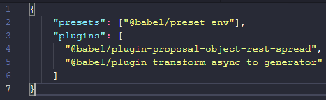

<h1> Async & Await </h1>

Essa parte é bem interessante e nós não podíamos ir adiante sem antes conhecer um pouco mais sobre essa feature do ES6+, então vamos lá. Antes de mais nada vou passar de forma bem sucinta o que exatamente é esse recurso, basicamente o <em>Async/Await</em> é uma forma de trabalharmos com a programação assíncrona no JavaScript, você provavelmente já utilizou em algum momento em seus estudo com javascript alguma promise, as promise por sua vez são funções que solicitam requisições a <em>Api, EndPints, backend</em> e etc, de maneira assíncrona ou não.

Ela é muito útil quando precisamos consumir dados de algum lugar de maneira síncrona/assíncrona isso nos retorna um <i>JSON</i> por exemplo, daí podemos trabalha com esses dados em nossa página web. Também é possível criar promises mas por enquanto não iremos entrar em tetalhes aqui nesse tópico e sem mais delongas vamos logo direto ao <i>Asysnc/Await</i> na prática.

A primeira coisa que devemos fazer é instalar dois novos<i>plugins do babel</i>, isso é necessário porque o <em><i>babel não compreende todas as feature do JS6+ de forma nativa (ES9 por exemplo) então ele precisa de recurso auxiliares para tornar isso possível</i></em>, uma vez instalados, esses plug-ins auxiliares irão permitir que o babel compreenda <i>async/await</i> e os transpile da maneira mais coerente possível; Então vamos ver como instalar e configurar esses plug-ins:

<pre>
  <ul>
    <li>$ yarn add @babel/plugin-transform-async-to-generator -D </li>
    <li>$ yarn add @babel/polyfill –D </li>
  </ul>
<pre>

OBS: <em>“-D”</em> indica que essa instalação será feita em ambiente de desenvolvimento.  
Feita as devidas instalações vamos realizar algumas alterações em nossos arquivos .babelrc e <i>webpack.config.js</i> abra o arquivo <i>.babelrc</i> e deixe-o da seguinte forma:

Em seguida abra o arquivo webpack.config.js alterando apenas entry, veja como deve ficar seu arquivo:

Pronto salve essas alterações e vamos pra pratica
